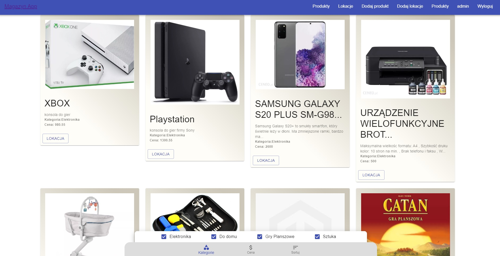
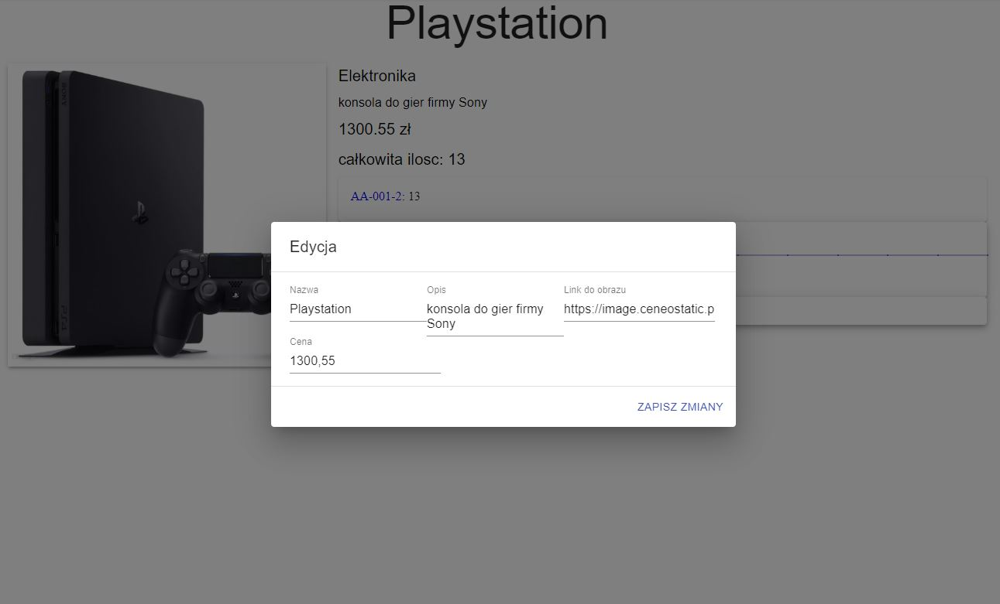

# Warehouse App
> Project for **Programming technologies - internet systems** course

## Table of contents
* [Live version](#live-version)
* [General info](#general-info)
* [Screenshots](#screenshots)
* [Technologies](#technologies)
* [Setup](#setup)

## Live version
[Heroku](https://warehouse-front.herokuapp.com/products/2)

## General info
Application is capable of
* adding a new item
* displaying details about: 
  * item item in stock
  * name
  * location
  * number of pieces available
  * price 
* removing the item when number of pieces equals 0.

## Screenshots

## Technologies
* **React** 16.13.1
* **Material-UI**  4.9.14
* **Axios**  0.19.2
* **Java**  8
* **Spring Boot**  2.2.7
    * Web
    * Data JPA
    * Data Rest
    * Security
    * H2 Database
* **Java JWT**  0.9.1
* **Frontend maven plugin**  1.6

## Setup
Run `$ mvn clean install`
